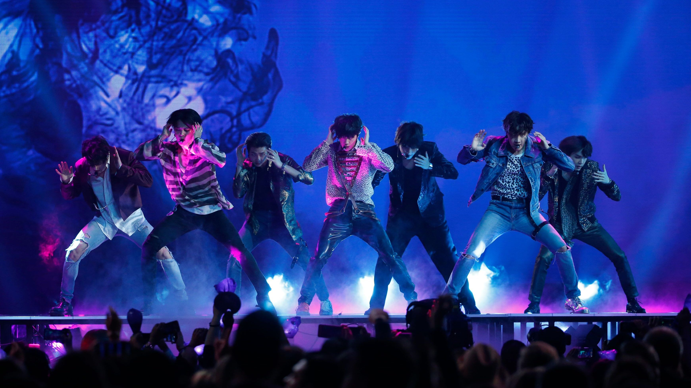
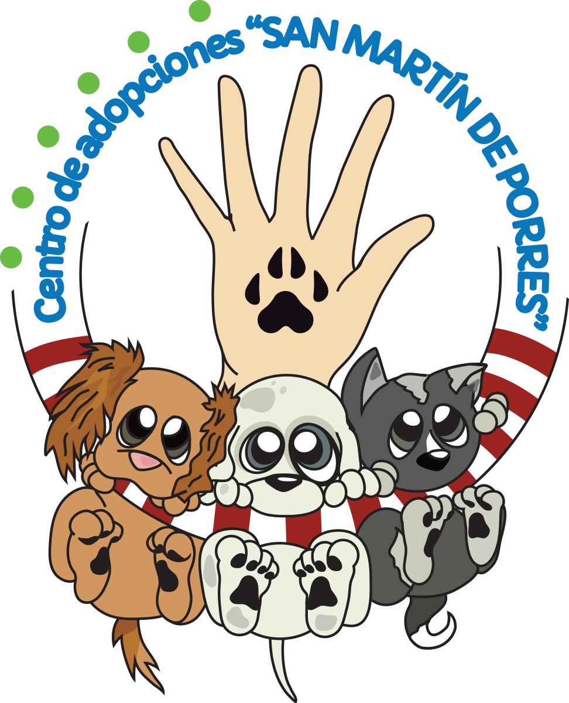
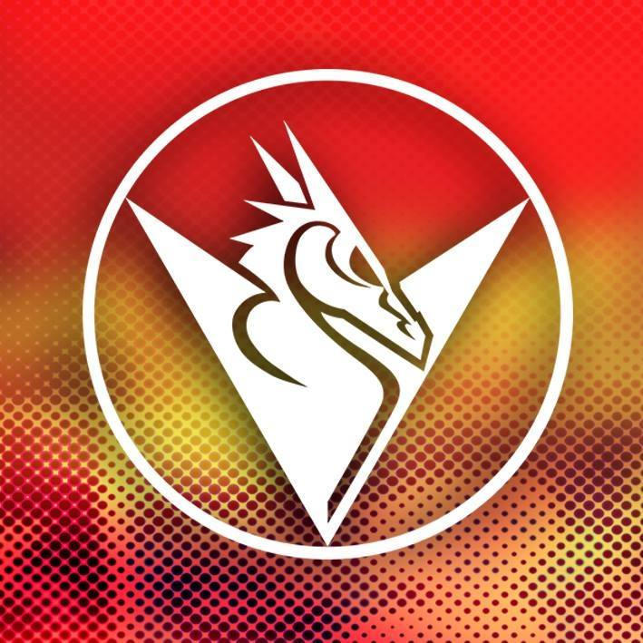
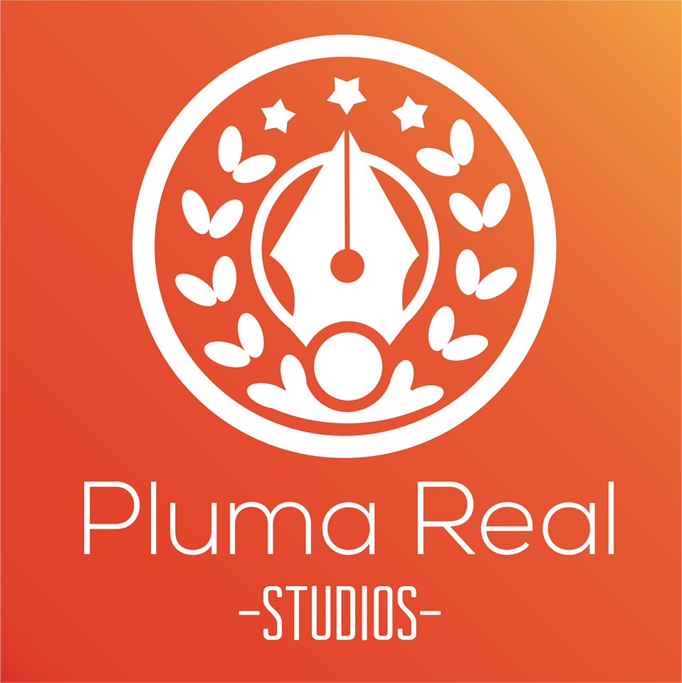

<!-- Main -->

<!-- One -->
<section id="one">
	

		<header class="major">
			<h2>Ultimas noticias</h2>
		</header>
				
Nuestros amigos de ProntoWebs, nos tentran actualizados por medio de su red social Twitter con lo ultimo en cada una de las diferentes areas, no dejes de revisar y estar al tanto de los mejores eventos.

<a class="twitter-timeline" href="https://twitter.com/WebsPronto?ref_src=twsrc%5Etfw">Tweets by WebsPronto</a>  	
	

</section>

<!-- Two -->
<section id="two" class="spotlights">
	<section>
		
		

			<!--
-->
				<header class="major">
					<h3>Cronograma</h3>
				</header>
				<!--
Revisa el cronograma de este pabellon.
-->
				<iframe width="100%" height="600px" src="https://docs.google.com/spreadsheets/d/e/2PACX-1vRVJpPvNvtacdbqovh2a-wHnjy1oteWzou1S__JBQN36FaNKNuVrzativAXx3nb83bTvOivkpEJrsdf/pubhtml?gid=0&amp;single=true&amp;widget=true&amp;headers=false"></iframe>
	
				<!--<ul class="actions">
					<li><a href="generic.html" class="button">Learn more</a></li>
				</ul>-->
			<!--
-->
		

	</section>
	
	
	<section>
		
		

			

				<header class="major">
					<h3>Patrocinadores</h3>
				</header>
		

		
<a href="http://prontowebs.com/"></a>
		

		
<a href="http://www.cienciayarte.org/"></a>
		
		
<a href="https://www.facebook.com/CentroDeAdopcionesSanMartinDePorres/"></a>
	
		
<a href="https://www.facebook.com/DisenhoGraficoYa/"></a>
	
		
<a href="https://www.facebook.com/LEVIATANBOLIVIA/"></a>
	
		
<a href="https://www.facebook.com/PlumaRealStudios/"></a>
			
		

	

			

		

	</section>
</section>

<!-- 
<section id="three">
	

		<header class="major">
			<h2>Massa libero</h2>
		</header>
		
Nullam et orci eu lorem consequat tincidunt vivamus et sagittis libero. Mauris aliquet magna magna sed nunc rhoncus pharetra. Pellentesque condimentum sem. In efficitur ligula tate urna. Maecenas laoreet massa vel lacinia pellentesque lorem ipsum dolor. Nullam et orci eu lorem consequat tincidunt. Vivamus et sagittis libero. Mauris aliquet magna magna sed nunc rhoncus amet pharetra et feugiat tempus.

		<ul class="actions">
			<li><a href="generic.html" class="button next">Get Started</a></li>
		</ul>
	

</section>
Three -->

